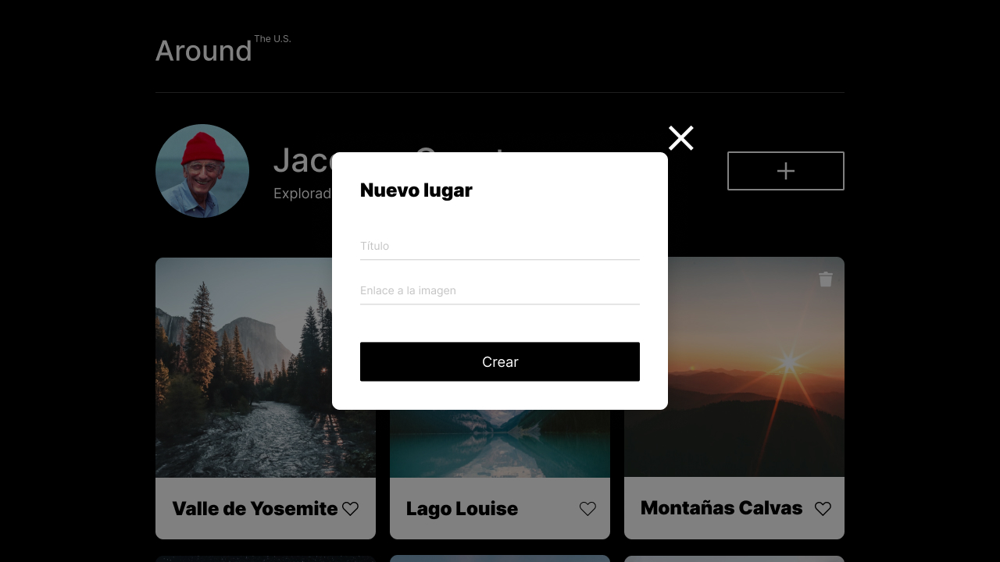
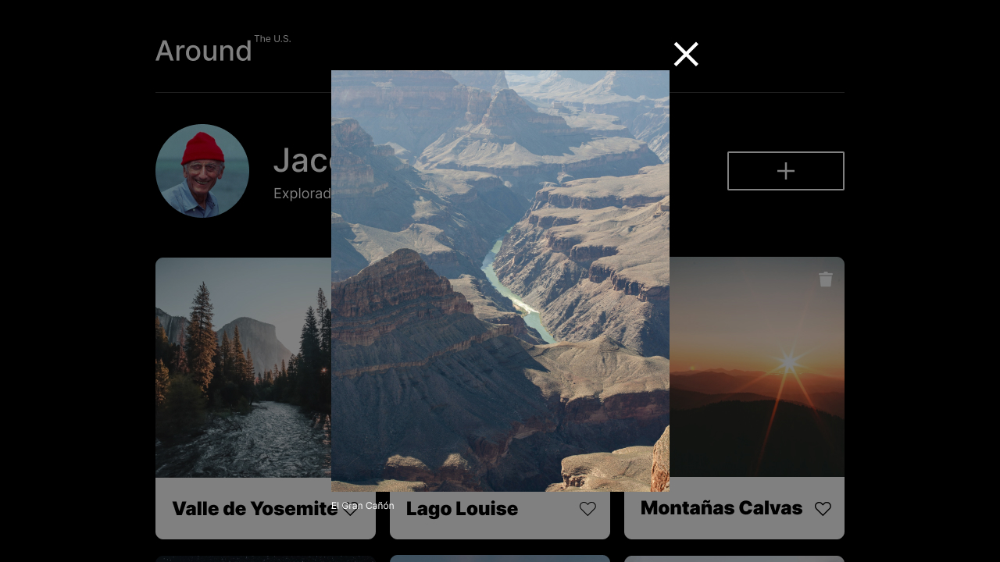

# Tripleten web_project_around_react

---

## Descripción:

Esta es la primera etapa para transferir a React el proyecto "Alrededor de Usa", para lograr esto, se necesitará trasladar el marcado HTML y por medio de Javascript transformarlos al formato de archivos"JSX", además se desarrollaran los componentes principales que nos permitirán agregar las primeras funcionalidades como por ejemplo abrir los formularios emergentes. El objetivo principal es que se creen todos los componentes JSX necesarios para replicar el diseño del proyecto como se muestra en el siguiente apartado.

### Imagen del diseño del proyecto llamado "Alrededor de los EE.UU":

### Funcionalidades y habilidades aprendidas:

1. Crear un nuevo proyecto de React con Vite, instalar sus dependencias y modificar los archivos de configuracion para que todo funcione correctamente.

2. Crear componentes de React para que el marcado "HTML", y los estilos "CSS" se monten usando los paradigmas declarativo y componente haciendo que se vuelva mucho más agradable mantenerlo y desarrollarlo, y que sea vea igual al diseño planteado.

3. Renderizar los componentes emergentes utilizando hooks y cambios de estado.

4. Las tarjetas y la información sobre el usuario se renderizan adecuadamente en la página.

5. Desarrollar el componente ImagePopup, para que las imágenes emergentes aparezcan y se cierren al hacer click en las tarjetas.

## Segunda Parte

La segunda entrega del proyecto se enfoca en la funcionalidad de la pagina, en donde se continuará transfiriendo el sitio web "Alrededor de los EE.UU." a React, aplicando el envio de datos de formularios y otra información a la API. Tambien se aplicaran varias metodologias como el levantamiento de estados, creacion y suscripcion de contextos, y uso de referencias.

### Funcionalidades agregadas:

- Cuando se carga la página, automaticamente se reenderizan las tarjetas obtenidas directamente desde la API mediante estados.
- Crear un objeto de contexto y utilizar el proveedor, para que todos los componentes de la aplicación puedan suscribirse y tener acceso a los datos del usuario actual (Current User).
- Agregar el soporte de "likes" y "dislikes" en las tarjetas, si el usuario hace clic en el, el corazón alterna su color entre blanco y negro.
- Dar soporte al boton trash para eliminar una tarjeta de la galeria, usando el formulario de confirmacion.
- Agregar el soporte para editar el perfil y Guardar los datos en la API, mediante el levantamiento del estado popup de Main a App.
- Utilizar referencia para obtener acceso directo al elemento de entrada del DOM del avatar y permita editar la foto de perfil.
- Dar soporte al formulario de creacion de tarjeta para agregar una nueva tarjeta a la galeria, usando componentes gestionados o refs para obtener los valores de entrada.

### Imagen de la pagina final, con los respectivos cuadros emergentes totalmente Funcionales:

### Cosas aprendidas en la segunda parte:

1. Adquirí un mejor entendimiento sobre la Sintaxis SJX para escribir componentes y la lógica de los cambios de estado, especialmente en lo que respecta al manejo de controladores y props.

2. Aprendí el uso de distintos hooks para implementar varias funciones que facilitaron la interacción con los elementos html, como por ejemplo las refs, los contextos, los efectos y los levantamientos de estado.

3. Aprendí a resolver los conflictos que se presentan cuando transfieres el marcado HTML y JS a JSX, usando la logica para adaptar los metodos y funciones al nuevo paradigma de React.

## Técnologías utilizadas:

&nbsp;
&nbsp;
&nbsp;
&nbsp;
&nbsp;
&nbsp;

---

## Enlace a la Página de GitHub:

### https://leo2434.github.io/web_project_around_react/
